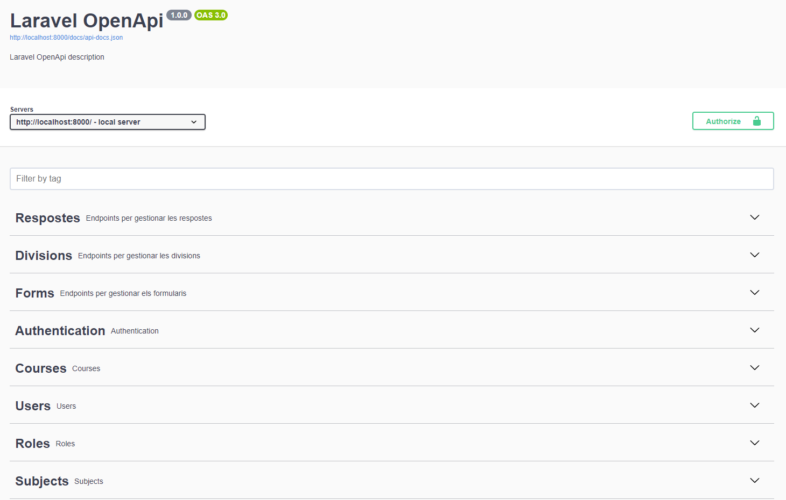

# Groupify
**Integrants del projecte:**
Aleiram Minaya, Lucas Benitez, Araceli Pacheco, Joselyn Ninahuaman, Adrià Estévez.
- Un projecte de gestió de grups dins dels centres educatius per evitar el risc d'exclusió/bullying. Fem servir eines com Taiga per la gestió de treball en grup amb metodología SCRUM <!--i sistema per generar grups automátics, INSERTAR AQUI ENLACE TAIGA, figma/penpot, URL PRODUCCIÓ, estado actual del proyecto-->

## 🐳 Projecte amb Vue, Nodejs + Laravel 🐳

1. **Clona el projecte**
    ```bash
    git clone https://github.com/inspedralbes/DAWTR2GX_g10_gestioeduca.git
## 🚀 Requisits

Abans de començar, assegura't de tenir instal·lat el següent component:

- **Docker**: [Guía d'instalació oficial](https://docs.docker.com/get-docker/)
    ```bash
    sudo apt-get install docker-ce docker-ce-cli containerd.io docker-buildx-plugin docker-compose-plugin
    sudo docker run hello-world # Verifica si s'ha instal·lat correctament.
- Utilitza aquesta comanda per evitar fer `sudo` cada vegada que utilitzes docker
    ```bash
    sudo usermod -aG docker $USER
**Aixeca els serveis de forma senzilla (Vue, nodejs y laravel)**
- Les **comandes principals** per obrir el projecte de forma ràpida i segura.
    ```bash
    cd DAWTR2GX_g10_gestioeduca
    docker-compose up # Encendre els contenidors
    firefox "localhost:5173" # Vue
    firefox "localhost:9090" # Adminer
    firefox "localhost:8000" # Laravel
    docker-compose down # Apagar els contenidors
Aquest projecte utilitza Docker per gestionar de manera senzilla els serveis del frontend i backend.

---

## Documentació Laravel (APIs)
Aquest projecte utilitza swagger com a eina per documentar de manera visual les APIs creades. 

Pots **veure tota la informació** fent docker compose up (comprova que laravel està en funcionament) i entras a **"localhost:8000/api/documentation"**


Proporcionem informació sobre:

1. Totes les rutes existents
2. Les taules utilitzades
3. En quina ruta es realitza cada petició
4. Requeriments al body (si es obligatori o no)
5. Quin Schema has d'utilitzar al body
    ```bash
    {
        "email": "adria@inspedralbes.cat",
        "password": "password123",
    }
6. Tipus de petició (POST, GET, PUT, DELETE)
7. Descripció de cada peticio
8. Descripció de cada resposta amb el seu codi corresponent (200 = Exitós. 404 = No trobat...)
9. Parametres necessaris per cada API en particular
    ```bash
    localhost:8000/api/courses/{id} #ID del curs sería un paràmetre obligatori.
---

# 📂 Estructura del projecte
El projecte està dividit en dos directoris principals:

- **Back/:** Conté el codi i els serveis per al backend (laravel / nodejs).
- **Back/node-app:** Conte el nodejs dins del back
- **Front/:** Conté el codi i els serveis per al frontend.

# Convenciones para los Commits
chore: Cambios menores que no afectan el código de producción, como actualizaciones de dependencias o tareas de mantenimiento.
```
chore: update dependencies
```
docs: Cambios relacionados con la documentación del proyecto
```
docs: update README with new setup instructions
```
fix: Corrección de errores en el código que solucionan problemas identificados
```
fix: resolve issue with user authentication
```
feat: Adición de nuevas funcionalidades o características al proyecto.
```
feat: add user profile page
```
refactor: Cambios en el código que mejoran la estructura o el rendimiento sin modificar la funcionalidad.
```
refactor: simplify user authentication logic
```
test: Añadir o modificar pruebas en el proyecto.
```
test: add unit tests for user profile component
```

